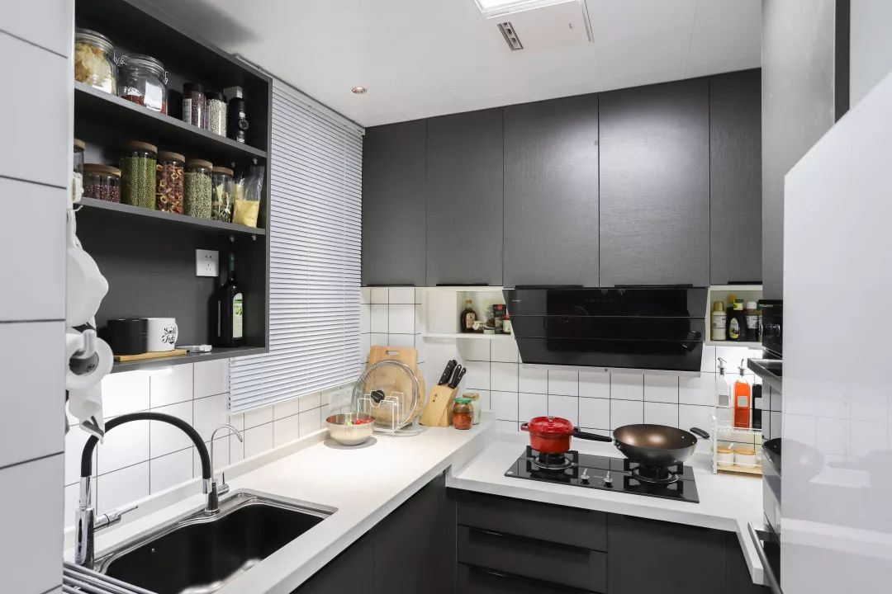

# 七里新都装修

## 设计效果图

### 一栋 01 室
1. 风格一： https://pano.kujiale.com/cloud/design/3FO4C65W5DKB/show?friendid=3FO4JY3I1P1F&fromqrcode=true

***

### 七里新都装修店铺及联系方式

1. 老板油烟机
```
1.  全冬梅 13197047589, 大冶红星美凯龙四楼老板电器.
```

2. 瓷砖
```
1.冠珠瓷砖: 喻红梅，19986207099，大冶红星美凯龙一楼冠珠陶瓷。
```

***
### 家电

#### 集成灶介绍
1. https://zhuanlan.zhihu.com/p/259146418

#### 净水器介绍
1. https://zhuanlan.zhihu.com/p/252591708

#### 蹲便器常识
1. https://zhuanlan.zhihu.com/p/313591441

***
### 注意点
1. 厨房灶台高低设计,灶台(80cm), 水槽区(90cm)


2. 卫生间一定要做存水弯，不然很臭.

3. 水电
```
a. 禁止水电同槽.
b. 水线在电线下面.
c. 尽量不要在墙上开横槽.
d. 线与线的间隔不能小于15mm， 否则日后有空鼓开裂的隐患.
e. 花撒冷热水出水口一定要水平，不能倾斜.

其他:
a. 厨卫的开槽封填，用水泥，不能用快干粉.

```

4. 瓷砖
```
常识:

1. 地砖能贴墙，单墙砖不能贴地.
原因：地砖每天被踩来踩去，要有很好的耐磨性与坚硬度，吸水率低。而墙砖的主要卖点是花色丰富，作为地砖，是万万不能的；而地砖上墙，则是可以的。

2. 室内最常用的砖，基本有三类：抛光砖、抛釉(you 第四声)砖、釉面砖
a. 

```