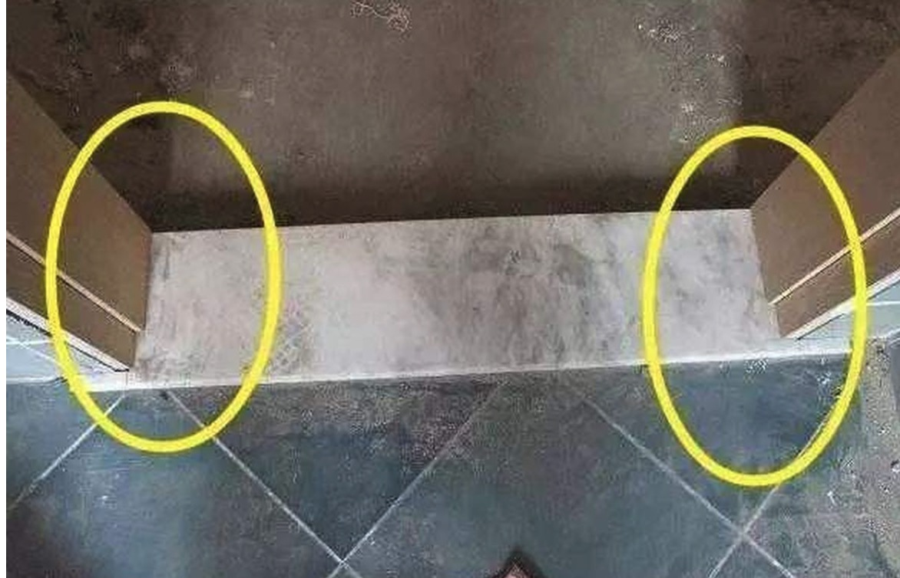

# 注意点

## 卫生间
+ 检查瓷砖空鼓问题.
 
+ 墙砖需要压着地砖.

+ 墙砖需要用瓷砖粘贴剂(薄贴)

+ 瓷砖必须是300 x 300的，斜水坡一定是有效的.(往四周泼水校验)

+ 防水需要做1.8米.

+ 门槛石需要做耳朵，垫着门套.    
&ensp; &ensp; 

+ 冷热水管出水处一定要水平.
   
+ 卫生间出水管必须防止反味. (存水弯，自封防臭地漏)

---

## 厨房
1. 墙砖需要压着地砖.

2. 墙砖需要用瓷砖粘贴剂（薄贴）

3. 水管/地漏 同上.
